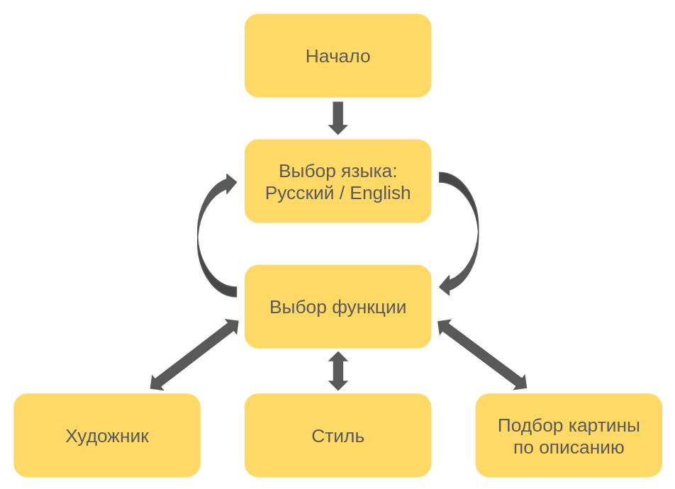

# AI-ArtInfo

## Основная идея проекта: 
- Хотите создать правильное первое впечатление? Подчеркнув на свидании свои знания об импрессионизме, это не составит труда 
- "Ну там, где медведи сидят в соснах...." не нужно судорожно перебирать в памяти все картины с животными - бот покажет наиболее подходящие произведения по вашему описанию

## Что внутри? 

## Использование 

## Над проектом работали: 
[Анна Савицкая](https://github.com/SaviAnn) 
[Мария Козлова](https://github.com/MARI-posa) 
[Виктория Князева](https://github.com/vvv-knyazeva) 

Art Guide
https://drive.google.com/file/d/1nHM5dy5fqjx9ux_hl1cgklgf-ajNrIrF/view?usp=sharing

